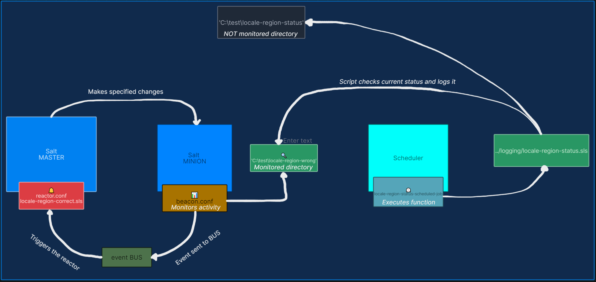

# Salt - Windows minion reactor setup with scheduler and beacon

Setup is based on official [Salt user guide](https://docs.saltproject.io/salt/user-guide/en/latest/index.html) documentation.

Locale region format is simple example on how to adjust configuration of minion with Windows OS, there is reg specific module that will help you getting that running via Salt. I'm using powershell script approach and using cmd.script function in the salt state file.

> ⚠ To make Scheduler, Beacon, Reactor trio working: salt-minion must use 'Log On' service property and fill in the credentials into This account option. If you don't set that then beacon will not work and consequently reactor as well.
 
Scheduler's job starts the powershell script that checks and logs current state of locale region format on the minion. Depending on the result it will send log file in designated directories `status / corrected / wrong`

## Salt project official documentation used for this setup 
Scheduler:

- https://docs.saltproject.io/salt/user-guide/en/latest/topics/scheduler.html  
- https://docs.saltproject.io/en/latest/ref/states/all/salt.states.schedule.html 

Beacons: 
- https://docs.saltproject.io/salt/user-guide/en/latest/topics/beacons.html  
- https://docs.saltproject.io/en/latest/ref/states/all/salt.states.beacon.html  

Reactor: 
- https://docs.saltproject.io/salt/user-guide/en/latest/topics/reactors.html  
- https://docs.saltproject.io/en/latest/topics/reactor/ 

## Other useful links:
- https://docs.saltproject.io/en/latest/ref/modules/all/salt.modules.reg.html
- https://docs.saltproject.io/en/latest/ref/states/all/salt.states.cmd.html
-  https://learn.microsoft.com/en-us/windows/win32/intl/table-of-geographical-locations
-  https://learn.microsoft.com/en-us/windows-hardware/customize/desktop/unattend/microsoft-windows-international-core-userlocale

## How to use
I set structure of directories but we all most likely have different setups, there are parts missing potentially. I made sure essentials for scheduler, beacon and reactor are there and they help you understand where should they be configured.

## Verify all is running as expected
1. On salt master start `salt-run state.event pretty=true`
2. To test you can set scheduler and beacon interval to 20s both
3. On the minion set locale region format to a value that is not expected
4. Modify file in the Beacon watched directory
5. Watch the state.event you'll see scheduler job first, following beacon and reactor

ℹ Help yourself also with the minion log that is by default located in:
`C:\ProgramData\Salt Project\Salt\var\log\salt\minion`

> Last time tested (20.04.2025) on master and minion, that were based on versions:  
> - [3007.0](https://docs.saltproject.io/en/latest/topics/releases/3007.0.html#salt-3007-0-release-notes)

## Credits
Saltstack is available at: https://github.com/saltstack/salt / https://www.saltprojectstore.io  
License: https://github.com/saltstack/salt?tab=Apache-2.0-1-ov-file  
Contributors to what I used in this example: https://github.com/saltstack/salt/graphs/contributors 
Kudos to Salstack Windows workgroup for helping me out through this journey! 
Powershell scripts are my own creation.

## Disclaimers
The use of scripts or shared content is solely at your own risk. I do not guarantee its accuracy, reliability, or suitability for your specific needs. No responsibility is taken for any damages or losses that may result from its use. It is recommended that you carefully review and test the content before implementation!  
